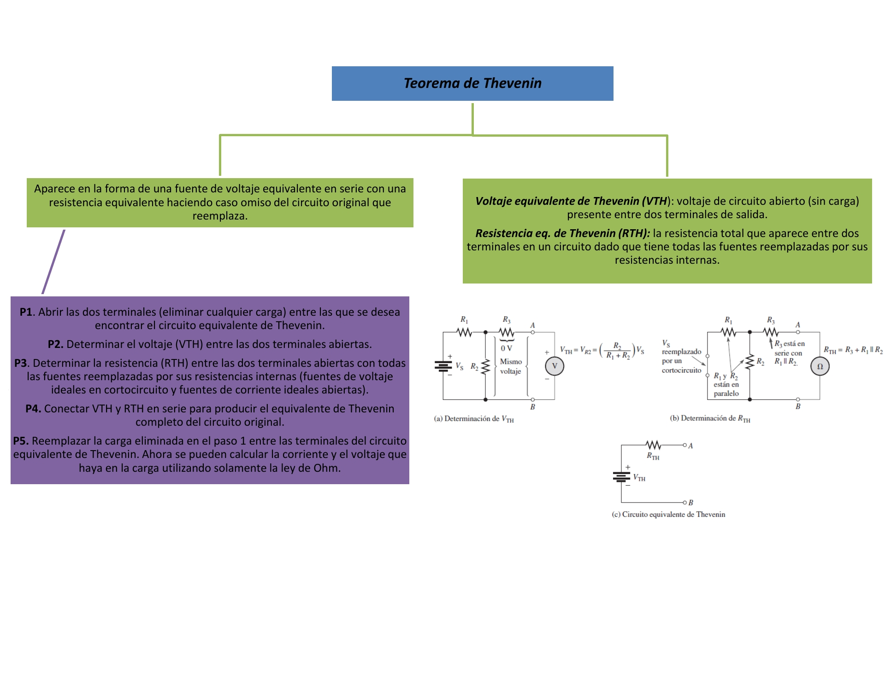
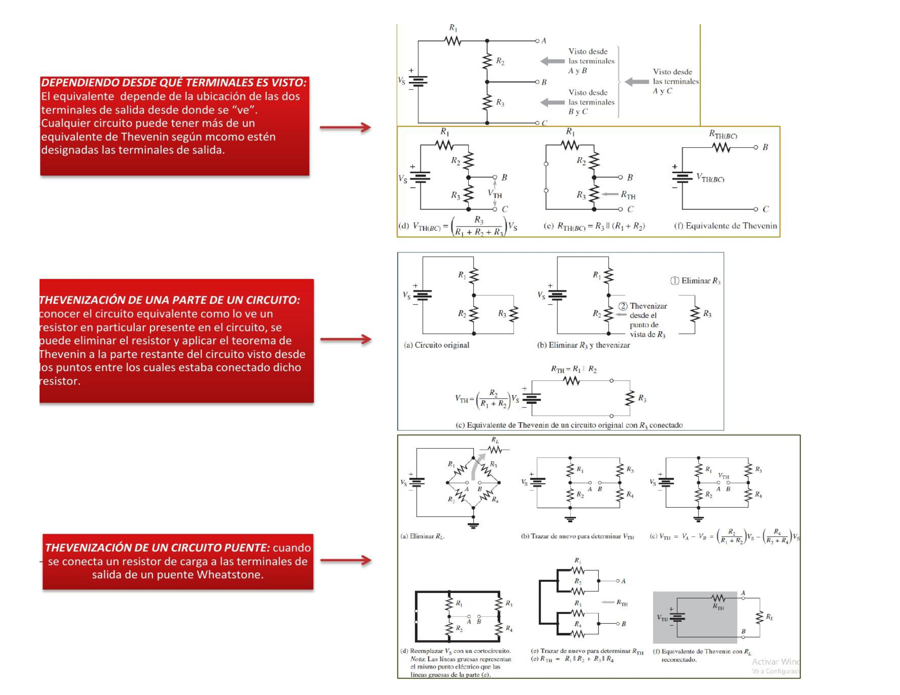

# Informe 5
1. OBJETIVOS 

• Emplear el teorema de Thevenin  para representar el circuito mostrado en el laboratorio como un circuito dual o equivalente, empleando una sola fuente de voltaje en serie con una resistencia equivalente. Analizar el circuito, y deducir los errores porcentuales entre el cálculo teórico y práctico,  y entre la aplicacion del circuito equivalente de Thevenin y el circuito normal. 

• Conocer más  a fondo los fundamentos básicos de este teorema y su aplicación en la vida real.

• Encontrar los parametros previos, necesarios para el calculo (Voltaje de thevenin, Resistencia equivalente de thevenin)

• Comprobar experimentalmente que se cumpla el teorema en estudio.

2.MARCO TEÓRICO

El teorema de Thevenin proporciona un método para simplificar un circuito a una forma equivalente estándar. Se utiliza para hacer más sencillo el análisis de circuitos complejos.

El equivalente de Thevenin de cualquier circuito depende de la ubicación de las dos terminales de salida desde donde se “ve” dicho circuito. De esta forma se pude clasificar en:

3. DIAGRAMAS

Diagrama  general (circuito)

Circuito en tinkercad (medición de voltaje y corriente)

Circuito en tinkercad (medición de  voltaje de Thévenin)

Circuito en tinkercad (medición resistecia equivalente de Thévenin)

Circuito equivalente de Thévenin  (medición voltaje y  corriente)

4. LISTA DE COMPONENTES

5. EXPLICACIÓN 

Calculo  de voltaje y corriente en R5

Calculo valor de voltaje y resistencia equivalente de Thévenin

Calculo de la corriente y voltaje empleando los valores equivalentes de Thévenin

Tablas

Calculo de errores

6. CONCLUSIONES:

•	El Teorema de Thévenin tiene como objetivo simplificar los cálculos de un sistema eléctrico complejo  por un circuito eléctrico equivalente mucho mas simple, constituido por una fuente de tensión y una resistencia equivalente. 

• Esta práctica nos permitió visualizar experimental y matemáticamente como se emplea el Teorema de Thevenin, el cual consiste en que el valor de las resistencias puede ser reemplazada o sustituida por otra fuente de tensión.

• En cuanto a los resultados obtenidos podemos llegar a la conclusión de que se obtuvieron resultados satisfactorios, ya que el porcentaje de error que se obtuvo fue muy bajo de entre 0 y 2 porciento.

 
7. BIBLIOGRAFÍA

• Floyd Thomas L, “Principios de Circuitos Eléctricos”, 8 ed. 2007 .Pearson Educación de México, S.A. de C.V. México, pp. 281-333.

• Alulema Darwin (2020). Capítulo 3. Teorema de Thevenin. Pags 48-55. 

• Teorema de Thévenin. 2017. Ecured. Recuperado de: https://www.ecured.cu/Teorema_de_Thévenin

• Veloso C (2017). TEOREMA DE THÉVENIN – CIRCUITO EQUIVALENTE. Recuperado de https://www.electrontools.com/Home/WP/teorema-de-thevenin-circuito-equivalente/

